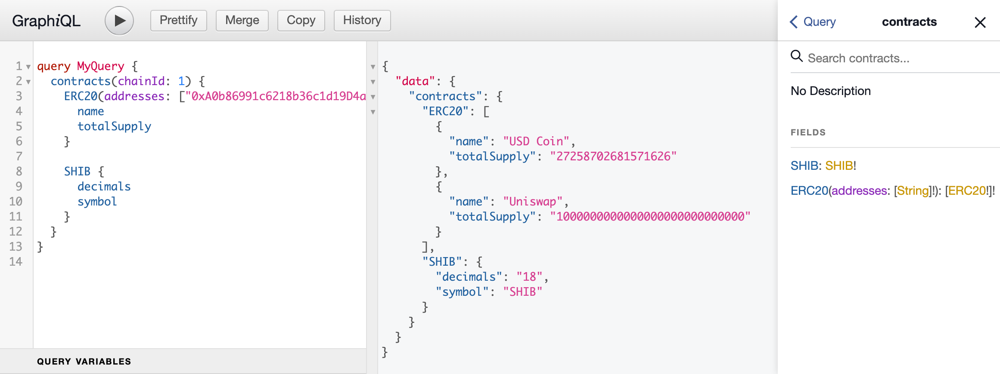
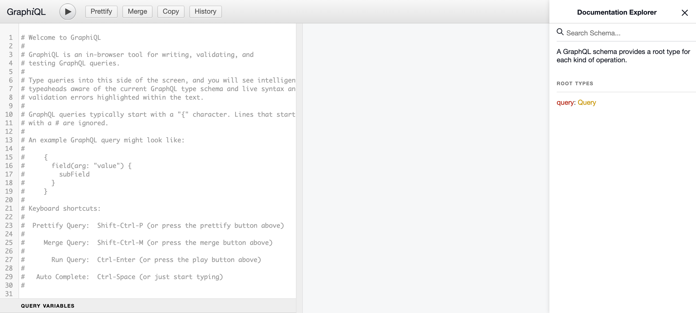

<p align="center"></p>

<h2 align="center">Query any blockchain data using GraphQL</h2>

<p align="center">eth-graphql is a client-side GraphQL solution to fetch data from contracts
deployed on evm-compatible blockchains</p>

<p align="center"></p>

## Killer features

🤝 Automatically generated GraphQL schema to call any contract
on the blockchain

⚡️ Requests are automatically batched using multicall

🛠 Benefit from all the GraphQL and Apollo Client tools (optimistic updates,
cache normalization etc.)

🤖 TypeScript support through Codegen

## Getting started

### Install eth-graphql and its peer dependencies

Using yarn:

```bash
yarn add eth-graphql @apollo/client@^3.x ethers@^5.x
```

or npm:

```bash
npm install eth-graphql @apollo/client@^3.x ethers@^5.x
```

### Create config file

Anywhere in your project, create a .js or .ts file (e.g.: ethGraphQlConfig.ts)
that exports a `config` object as default:

```typescript
import erc20Abi from "./abis/erc20.json";
import { Config } from "eth-graphql";
import { providers } from "ethers";

const RPC_PROVIDER_URL = "https://ethereum.publicnode.com";
const provider = new providers.JsonRpcProvider(RPC_PROVIDER_URL);

const config: Config = {
  chains: {
    1: {
      provider,
    },
  },
  contracts: [
    {
      name: "SHIB",
      address: {
        1: "0x95aD61b0a150d79219dCF64E1E6Cc01f0B64C4cE",
      },
      abi: erc20Abi,
    },
  ],
};

export default config;
```

Note: if you wish to follow this example, you can find the ABI of the ERC20
contract [here](example/src/abis/erc20.json).

### Create link and attach it to Apollo client

```typescript
import config from "./ethGraphQlConfig";
import { ApolloClient, InMemoryCache } from "@apollo/client";
import { createLink } from "eth-graphql";

const link = createLink(config);

const client = new ApolloClient({
  cache: new InMemoryCache(),
  link,
});

export default client;
```

### Make your first query

You can now write your first GraphQL query to fetch data from contracts on the
blockchain!

```typescript
import { gql } from "@apollo/client";

const { data } = await client.query({
  query: gql`
    query GetTokens {
      contracts(chainId: 1) {
        SHIB {
          decimals
        }
      }
    }
  `,
});

console.log(data.contracts.SHIB.decimals); // 18
```

### GraphiQL interface

To see what the generated client-side schema looks like and get a playground to
test your queries in, you can start a GraphiQL server with the command:

```bash
yarn eth-graphql --config ./ethGraphQlConfig.ts
```

or with npm:

```bash
npm run eth-graphql --config ./ethGraphQlConfig.ts
```

_The config option represents the path to your config file, relative to the
directory from which you are running the command_

The command will automatically open
[http://localhost:8008/eth-call-graphiql](http://localhost:8008/eth-call-graphiql)
in your browser.

<p align="center"></p>

## Multi-chain support

In the previous example, we've configured only one chain. The config can however
be updated to support calling contracts on multiple chains:

```typescript
import erc20Abi from "./abis/erc20.json";
import { Config } from "eth-graphql";
import { providers } from "ethers";

const MAINNET_RPC_PROVIDER_URL = "https://ethereum.publicnode.com";
const mainnetProvider = new providers.JsonRpcProvider(MAINNET_RPC_PROVIDER_URL);

const TESTNET_RPC_PROVIDER_URL = "https://ethereum-goerli.publicnode.com";
const testnetProvider = new providers.JsonRpcProvider(TESTNET_RPC_PROVIDER_URL);

const config: Config = {
  chains: {
    1: {
      provider: mainnetProvider,
    },
    5: {
      provider: testnetProvider,
    },
  },
  contracts: [
    {
      name: "SHIB",
      address: {
        1: "0x95aD61b0a150d79219dCF64E1E6Cc01f0B64C4cE",
        2: "0x058d6Fb2828608C0422BB6C89F77CCaA9ea7A9b4",
      },
      abi: erc20Abi,
    },
  ],
};

export default config;
```

You can then choose which chain to fetch data from when making your query:

```typescript
import { gql } from "@apollo/client";

const { data: mainnetData } = await client.query({
  query: gql`
    query GetTokens {
      contracts(chainId: 1) {
        SHIB {
          decimals
        }
      }
    }
  `,
});

const { data: testnetData } = await client.query({
  query: gql`
    query GetTokens {
      contracts(chainId: 2) {
        SHIB {
          decimals
        }
      }
    }
  `,
});
```

## Calling contracts using dynamic addresses

You can omit to set an `address` property for a contract:

```typescript
import { Config } from 'eth-graphql';
import { providers } from 'ethers';

import erc20Abi from './abis/erc20.json';

const RPC_PROVIDER_URL = 'https://ethereum.publicnode.com';
const provider = new providers.JsonRpcProvider(RPC_PROVIDER_URL);

const config: Config = {
  ...
  contracts: [
    {
      name: 'ERC20',
      abi: erc20Abi,
    },
  ],
};

export default config;
```

In which case you will be able to pass an array of contract addresses to fetch
when making your query. Results will be returned as an array of outputs, sorted
in the same order as the input addresses:

```typescript
import { gql } from "@apollo/client";

const { data } = await client.query({
  query: gql`
    query GetTokens {
      contracts(chainId: 1) {
        ERC20(
          addresses: [
            "0xA0b86991c6218b36c1d19D4a2e9Eb0cE3606eB48"
            "0x1f9840a85d5aF5bf1D1762F925BDADdC4201F984"
          ]
        ) {
          name
        }
      }
    }
  `,
});

console.log(data.contracts.ERC20);
/* 
[{
  name: 'USD Coin'
}, {
  name: 'Uniswap'
}]
*/
```

## Using custom multicall addresses

eth-graphql uses the multicall contract from [0xsequence](TODO: add link to
0xsequence multicall contract repo) to batch all the calls from a single query
into one. You can find the list of supported chains [here](TODO: add link to
0xsequence repo).

If you wish to call contracts on a chain that is not supported
or if you simply want to use your own multicall contract, you can deploy
0xsequence multicall's contract ([code here](TODO: add link to contract)) and
pass the address of the deployed contract into your config:

```typescript
import { Config } from 'eth-graphql';
import { providers } from 'ethers';

import erc20Abi from './abis/erc20.json';

const RPC_PROVIDER_URL = 'https://ethereum.publicnode.com';
const provider = new providers.JsonRpcProvider(RPC_PROVIDER_URL);

const config: Config = {
  chains: {
    1: {
      provider,
      multicallAddress: '0x' // Add your multicall contract address here
    },
  },
  ...
};

export default config;
```

## Automatically generating types for queries with graphql-codegen

You can automatically generate TypeScript types for your queries using [Graphql
Codegen](TODO: add link to Codegen's documentation) and the `createSchema`
method from eth-graphql:

```typescript
// codegenConfig.ts
import ethGraphQlConfig from "./ethGraphQlConfig";
import type { CodegenConfig } from "@graphql-codegen/cli";
import { createSchema } from "eth-graphql";
import { printSchema } from "graphql";

const config: CodegenConfig = {
  overwrite: true,
  schema: printSchema(createSchema(ethGraphQlConfig)),
  documents: "**/*.tsx",
  generates: {
    ".gql/": {
      preset: "client",
      plugins: [],
      config: {
        scalars: {
          BigInt: "string",
        },
      },
    },
  },
};

export default config;
```

Visit [Graphql Codegen's documentation](TODO: add link to Codegen's
documentation "Get started" section) to see how to install it on your project
and automatically generate TypeScript types for all your queries.

## Choices taken

This library is opinionated and choices were taken in order to make the GraphQL
query language work with any contract ABI.

### Uint and Int

Mapped to custom scalar `BigInt` that accepts an integer or a string when being
passed as input and is always returned as a string in the GraphQL schema.

e.g. ABI:

```json
[
  {
    "constant": true,
    "inputs": [],
    "name": "totalSupply",
    "outputs": [
      {
        "name": "",
        "type": "uint256"
      }
    ],
    "payable": false,
    "stateMutability": "view",
    "type": "function"
  }
]
```

Generated GraphQL:

```graphql
type ContractName {
  totalSupply: BigInt!
}
```

### Bytes, string, address

Mapped to a string.

e.g. ABI:

```json
[
  {
    "constant": true,
    "inputs": [],
    "name": "name",
    "outputs": [
      {
        "name": "",
        "type": "string"
      }
    ],
    "payable": false,
    "stateMutability": "view",
    "type": "function"
  }
]
```

Generated GraphQL:

```graphql
type ContractName {
  name: String!
}
```

### Struct

Mapped to an object using a generated GraphQL type (input or output).

e.g. ABI:

```json
[
  {
    "inputs": [
      {
        "components": [
          {
            "internalType": "uint256",
            "name": "id",
            "type": "uint256"
          },
          {
            "internalType": "string",
            "name": "name",
            "type": "string"
          }
        ],
        "internalType": "struct ContractName.Category",
        "name": "",
        "type": "tuple"
      }
    ],
    "name": "getMovie",
    "outputs": [
      {
        "components": [
          {
            "internalType": "uint256",
            "name": "id",
            "type": "uint256"
          },
          {
            "internalType": "string",
            "name": "title",
            "type": "string"
          }
        ],
        "internalType": "struct ContractName.Movie",
        "name": "",
        "type": "tuple"
      }
    ],
    "payable": false,
    "stateMutability": "view",
    "type": "function"
  }
]
```

Generated GraphQL:

```graphql
type ContractName {
  getMovie(category: ContractName_CategoryInput!): ContractName_Movie!
}

input ContractName_CategoryInput {
  id: BigInt!
  name: String!
}

type ContractName_Movie {
  id: BigInt!
  title: String!
}
```

### Void output

Non-mutating functions that return nothing will return the custom scalar `Void`,
which is returned as `null`.

e.g. ABI:

```json
[
  {
    "inputs": [],
    "name": "getNothing",
    "outputs": [],
    "stateMutability": "pure",
    "type": "function"
  }
]
```

Generated GraphQL:

```graphql
type ContractName {
  getNothing: Void
}
```

### Tuples (input and output)

GraphQL does not give the option to set a specific length for arrays, whether
they are provided as input or returned as output. For that reason, tuples are
mapped to arrays without a set length in the GraphQL schema. Providing an array
with the wrong length (as described by the corresponding contract ABI) as input
will however throw an error.

e.g. ABI:

```json
[
  {
    "inputs": [
      {
        "internalType": "string[3]",
        "name": "someTuple",
        "type": "string[3]"
      }
    ],
    "name": "getTuple",
    "outputs": [
      {
        "internalType": "string[3]",
        "name": "",
        "type": "string[3]"
      }
    ],
    "stateMutability": "pure",
    "type": "function"
  }
]
```

Generated GraphQL:

```graphql
type ContractName {
  getTuple(someTuple: [String!]!): [String!]!
}
```

### Unnamed input arguments

Unnamed input arguments are given a generated name within the GraphQL schema
which follows the template: `argX`, where `X` represents the index of the argument
within the function arguments.

e.g. ABI:

```json
[
  {
    "inputs": [
      {
        "internalType": "string",
        "name": "",
        "type": "string"
      },
      {
        "internalType": "string",
        "name": "",
        "type": "uint256"
      }
    ],
    "name": "passUnnamedString",
    "outputs": [
      {
        "internalType": "string",
        "name": "",
        "type": "string"
      }
    ],
    "stateMutability": "pure",
    "type": "function"
  }
]

```

Generated GraphQL:

```graphql
type ContractName {
  passUnnamedString(arg0: String!, arg1: BigInt!): String!
}
```

### Unnamed output properties

Unnamed output properties are given a generated name within the GraphQL schema
which follows the template: `valueX`, where `X` represents the index of the
property within the function output.

e.g. ABI:

```json
[
  {
    "inputs": [],
    "name": "getUnnamedValues",
    "outputs": [
      {
        "internalType": "string",
        "name": "",
        "type": "string"
      },
      {
        "internalType": "uint256",
        "name": "",
        "type": "uint256"
      }
    ],
    "stateMutability": "view",
    "type": "function"
  }
]
```

Generated GraphQL:

```graphql
type ContractName {
  getUnnamedValues: getUnnamedValuesOutput!
}

type getUnnamedValuesOutput {
  value0: String!
  value1: BigInt!
}
```

### Overloaded functions

Overloaded functions are listed as individual functions, separated by their
names appended with their index within the ABI.

e.g. ABI:

```json
[
  {
    "inputs": [],
    "name": "overloadedFn",
    "outputs": [
      {
        "internalType": "string",
        "name": "",
        "type": "string"
      },
      {
        "internalType": "uint256",
        "name": "",
        "type": "uint256"
      }
    ],
    "stateMutability": "pure",
    "type": "function"
  },
  {
    "inputs": [
      {
        "internalType": "uint16",
        "name": "",
        "type": "uint16"
      }
    ],
    "name": "overloadedFn",
    "outputs": [
      {
        "internalType": "string",
        "name": "",
        "type": "string"
      },
      {
        "internalType": "uint256",
        "name": "",
        "type": "uint256"
      }
    ],
    "stateMutability": "pure",
    "type": "function"
  }
]
```

Generated GraphQL:

```graphql
type ContractName {
  overloadedFn0: overloadedFnOutput!
  overloadedFn1(arg0: BigInt!): overloadedFnOutput!
}

type overloadedFnOutput {
  id: BigInt!
}
```
