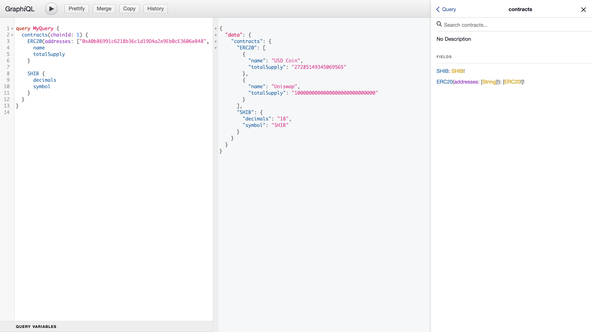

## Getting Started

Install dependencies:

```bash
yarn
```

Run the development server:

```bash
yarn dev
```

Open [http://localhost:3000](http://localhost:3000) with your browser to see the result.

## GraphiQL

Run the GraphiQL server:

```bash
yarn graphiql
```

Open [http://localhost:8008/eth-call-graphiql](http://localhost:8008/eth-call-graphiql) with your
browser to see the result.

<p align="center"></p>
